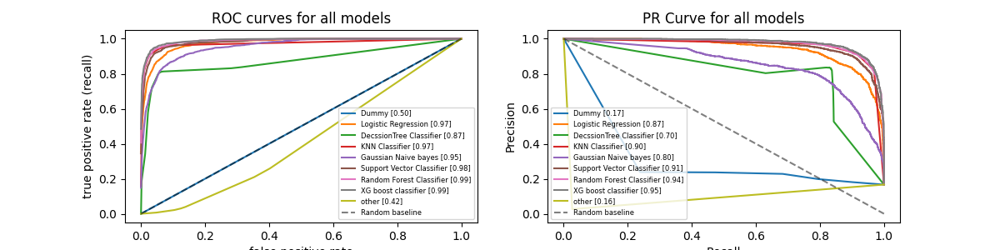

# Assignment 7 (Model Selection and Evaluation using ROC–AUC and PRC–AP)

## Student Info:
Name: Shashank Satish Adsule  
Roll No.: DA25M005

## Dataset Used
- [Landsat Satellite Dataset](https://archive.ics.uci.edu/dataset/146/statlog+landsat+satellite)
- this dataset cotains 
    - sat.trn [train set]
    - sat.tst [test set]
    - sat.doc [dataset descption]
- this dataset contains total 6435 sample entries in which 36 columns are features and last columns is class labels(multi-class categorical variable).  
    - unique class Id's are: [1,2,3,4,5,7] 

## Objective

The goal of this assignment is to perform **multi-class classification** using a variety of supervised learning models, compare their performance, and analyze evaluation curves such as **ROC–AUC** and **Precision–Recall (PRC)** curves.  

Specifically, the assignment aims to:
1. Train multiple machine learning models for the classification task.
2. Compute and visualize evaluation metrics such as:
   - F1-Score  
   - ROC–AUC (macro, micro, weighted)  
   - PRC–AP (Average Precision)
3. Interpret the performance curves (ROC and PRC) across models.
4. Understand trade-offs between precision, recall, and threshold selection.
5. Identify the **best-performing model** and justify the selection.

## Models Implemented
A total of **9 models** were trained and compared:
| Model No. | Algorithm | Library |
|:--:|:--|:--|
| 1 | Dummy Classifier | `sklearn.dummy` |
| 2 | Logistic Regression | `sklearn.linear_model` |
| 3 | Decision Tree Classifier | `sklearn.tree` |
| 4 | KNN Classifier | `sklearn.neighbors` |
| 5 | Gaussian Naive Bayes | `sklearn.naive_bayes` |
| 6 | Support Vector Classifier (SVC) | `sklearn.svm` |
| 7 | Random Forest | `sklearn.ensemble` |
| 8 | XGBoost Classifier | `xgboost.XGBClassifier` |
| 9 | ExtraTree Classifier (Other) | `sklearn.tree` |

## Evaluation Metrics used
For each model, the following metrics were computed:

| Metric | Description |
|:--|:--|
| **Accuracy** | Ratio of correctly predicted instances. |
| **F1-Score** | Harmonic mean of precision and recall at a specific threshold. |
| **ROC–AUC (macro/micro/weighted)** | Threshold-independent measure of ranking quality. |
| **PRC–AP (Average Precision)** | Area under the Precision–Recall curve, emphasizing positive class performance. |
| **Confusion Matrix** | Visualized per-model to observe misclassification patterns. |


## ROC and PRC Analysis
- **One-vs-Rest (OvR)** strategy used for computing per-class ROC curves.  
- **Macro-average** curves plotted for overall comparison.  
- PRC curves computed for each class and macro-averaged to observe model precision stability.  

## Observations
- XGBoost achieved the best overall performance across all metrics (F1 = 0.901, ROC–AUC = 0.990, PRC–AP = 0.975), showing excellent precision–recall balance and robust separability.

- Random Forest, SVC, and KNN also performed strongly, confirming their reliability for multi-class classification with good generalization.

- Logistic Regression produced stable but slightly lower recall, indicating limited handling of non-linear class boundaries.

- Decision Tree and Naive Bayes showed moderate performance and higher sensitivity to class imbalance.

- Dummy and ExtraTree models acted as baselines, performing near random with low ROC–AUC and PRC–AP values.

Overall, ensemble-based models (XGBoost and Random Forest) proved to be the most effective, offering the best trade-off between precision, recall, and classification stability.

## Model Comparison


- ROC-AUC and  PR curve of all models


- evaluation metric value of models (ranked by F1-score)

| Rank | Model | F1-Score | ROC–AUC | PRC–AP |
|:--:|:--|:--:|:--:|:--:|
| 1 | **XGBoost** | **0.901** | 0.990 | 0.975 |
| 2 | **KNN Classifier** | 0.900 | 0.973 | 0.930 |
| 3 | **Random Forest** | 0.889 | 0.987 | 0.969 |
| 4 | **Support Vector Classifier** | 0.876 | 0.982 | 0.960 |
| 5 | **Logistic Regression** | 0.815 | 0.974 | 0.940 |
| 6 | **Decision Tree Classifier** | 0.804 | 0.874 | 0.709 |
| 7 | **Gaussian Naive Bayes** | 0.775 | 0.954 | 0.841 |
| 8 | **ExtraTree Classifier (Other)** | 0.067 | 0.416 | 0.162 |
| 9 | **Dummy** | 0.064 | 0.500 | 0.217 |

## Python Dependencies
```bash
os                      # file and directory operations
pandas                  # data manipulation and tabular data analysis
numpy                   # numerical computations and array operations
matplotlib              # plotting and data visualization
seaborn                 # enhanced data visualization and statistical graphics
copy                    # deep and shallow object copying

scikit-learn            # core machine learning library for model building and evaluation
    ├── model_selection (train_test_split, cross_val_score KFold)
    │       # data partitioning, cross-validation, and performance evaluation
    ├── preprocessing (StandardScaler, label_binarize, LabelEncoder)
    │       # data scaling, encoding, and binarization for classification tasks
    ├── metrics (confusion_matrix, accuracy_score, classification_report, auc,
    │             average_precision_score, roc_curve, roc_auc_score,
    │             precision_recall_curve, precision_recall_fscore_support)
    │       # model performance evaluation for multi-class classification
    ├── dummy (DummyClassifier)
    │       # baseline classifier for comparison
    ├── linear_model (LogisticRegression)
    │       # linear models for binary and multi-class classification
    ├── tree (DecisionTreeClassifier, ExtraTreeClassifier)
    │       # decision tree-based models and single-tree estimators
    ├── neighbors (KNeighborsClassifier, NearestCentroid)
    │       # distance-based classification algorithms
    ├── naive_bayes (GaussianNB)
    │       # probabilistic classifier using Gaussian distribution assumption
    ├── svm (SVC)
    │       # support vector machine classifier for non-linear decision boundaries
    ├── ensemble (RandomForestClassifier)
    │       # ensemble learning method combining multiple decision trees
    └── neural_network (MLPClassifier)
            # feed-forward neural network for supervised classification

xgboost                 # gradient boosting framework for high-performance classification

warnings                # suppressing warning messages for cleaner output
```

## Conclusion (Insights & Trade-offs)

1. **Alignment Across Metrics:**
   - The top-performing models (**XGBoost**, **Random Forest**, **SVC**, **KNN**) rank highly across all three metrics, indicating robust overall performance.
   - Mid-performing models (Logistic Regression, Naive Bayes, Decision Tree) show more variation between ROC–AUC and PRC–AP.

2. **Trade-offs Observed:**
   - Models with high ROC–AUC but lower PRC–AP (e.g., Naive Bayes) separate classes well overall but struggle with precision for minority classes.
   - Decision Tree achieves moderate F1 but less consistent ranking (lower AUC), showing sensitivity to threshold choice.
   - PRC–AP highlights false-positive penalties better than ROC–AUC, especially for imbalanced data.

3. **Curve Behavior:**
   - ROC curves for top models lie near the top-left corner, confirming strong true-positive identification.
   - PRC curves show XGBoost and Random Forest maintain high precision even at high recall levels.
   - Dummy and ExtraTree show flat, near-random curves — expected from poor classifiers.


## Recommended Model

**Best Model:** XGBoost Classifier

**Justification:**
- Highest **ROC–AUC (0.990)** and **PRC–AP (0.975)** across all thresholds.  
- F1-Score (0.901) indicates strong balance between precision and recall.  
- ROC and PRC curves remain stable across thresholds, demonstrating well-calibrated probability outputs.  
- Outperforms others in precision–recall consistency and generalization, making it the best model for this dataset.


upload link: https://docs.google.com/forms/d/e/1FAIpQLSeWvvSR3nEaqyvpvGbh0n5w-j3eDkosZD6u3dimtV5Q619-Cw/viewform
